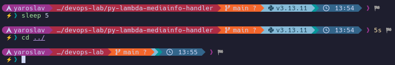
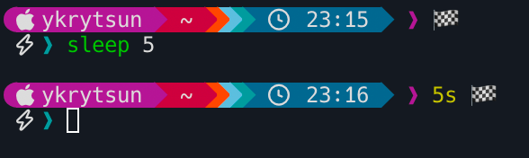

# devops-lab
A collection of useful scripts and tools for DevOps workflows, built from years of experience in my DevOps journey.

For each item, see the dedicated README.md inside its directory  (some still need to be added).

## Startship Prompt
Let's call it Yaro 😀






Get the Starship here: https://starship.rs/

### Installation

**! Please make sure to back up your current preset in case you want to revert.**
```bash
cp ~/.config/starship.toml ~/.config/starship.toml.bak
```

Install the preset
```bash
curl https://raw.githubusercontent.com/dyedfox/devops-lab/main/starship-preset/starship.toml -o ~/.config/starship.toml
```

## MediaInfo Lambda Function
`py-lambda-mediainfo-handler`

AWS Lambda function that extracts technical metadata from uploaded media files using MediaInfo and stores it as S3 object metadata.

## Lambda Function for Updating Registry (ECR) Authentication
`py-lambda-runpod-graphql-send`

This AWS Lambda function retrieves an authentication token from Amazon Elastic Container Registry (ECR) and updates registry authentication via a GraphQL mutation.

## Lambda Function for Terminating Orphaned Jenkins Worker Instances
`py-lambda-orphaned-instances-cleanup`

This AWS Lambda function scans for running EC2 instances based on predefined Name tags and automatically terminates those that have been running longer than the configured threshold (set via the `TIME_RUNNING_THRESHOLD_SECONDS` environment variable), preventing idle or orphaned instances from accumulating.
That was a response to the Jenkins EC2 plugin losing control over its instances.

### Variables
```bash
INSTANCE_NAMES = "jenkins-worker, jenkins-small-worker"
TIME_RUNNING_THRESHOLD_SECONDS = 14400
```

## ASG Management Script
`sh-asg-start-stop`

Manages AWS Auto Scaling Group capacity for ECS cluster.

## URL Processor Script
`sh-curl-from-file`

Processes URLs from a file and sends them to an API endpoint (image embedding as an example).

## AMI/Snapshot Cleanup Scripts
`sh-delete-snapshots`

### 1. Snapshot Cleanup (`snapshot-cleanup.sh`)
Deletes old EBS snapshots while keeping recent ones per volume.

### 2. AMI Cleanup (`ami-cleanup.sh`)
Deregisters old AMIs and associated snapshots by prefix.

## Service Discovery Lite 😀
`sh-get-ecs-ip-without-service-discovery`

This is a basic hardcoded replacement for proper service discovery—useful if you don't need the full setup. 😀

## File Upload Script
`sh-media-type-check-upload`

Validates and uploads media files to S3 with type checking and logging.

## EC2 Status Checker
`sh-reboot-unreachable-instances`

Monitors EC2 instances and reboots failed ones based on status checks and CloudWatch metrics.

## Slack Notification Script
`sh-slack-notifications`

Simple Bash script to send notifications to Slack via webhook.

## Simple Rsync Script
`sh-simple-rsync`

A simple Bash script for backing up data.

## Playlist Generator
`sh-generate-m3u-playlist`

Creates M3U playlists from audio files in a directory.